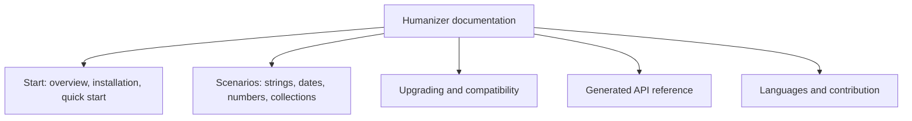
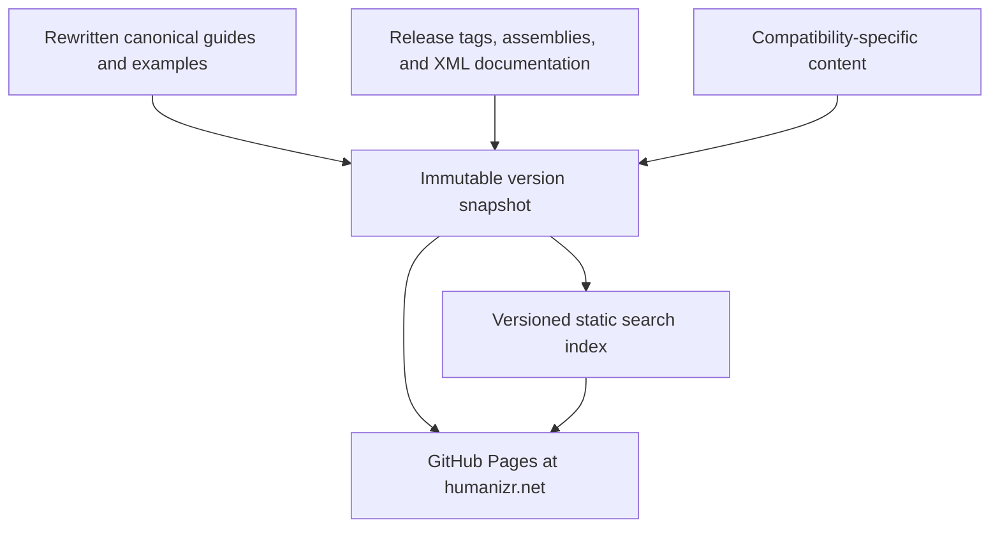
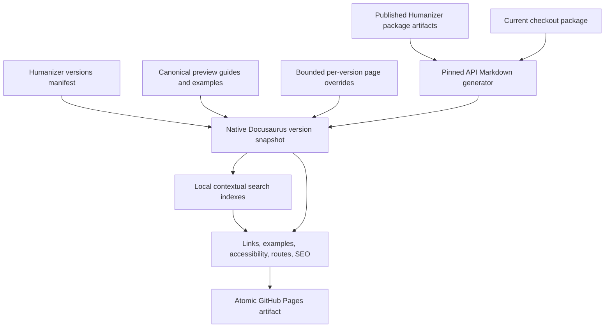
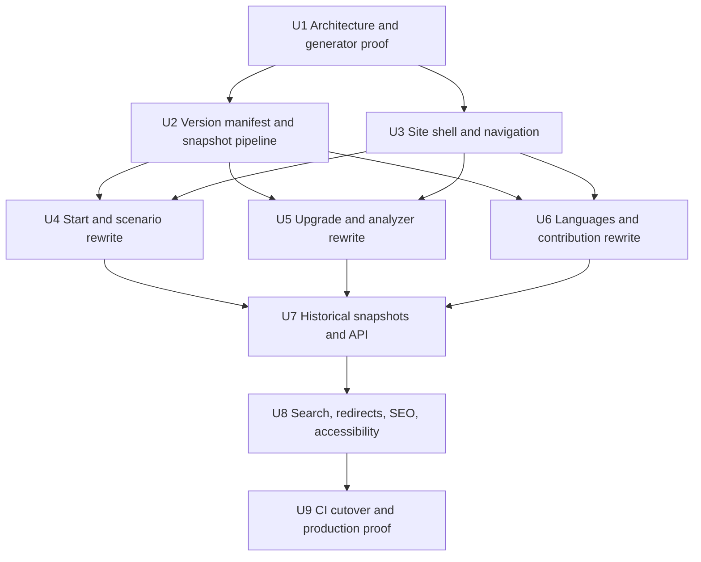

# Modern Humanizer Documentation Site - Plan

## Goal Capsule

- **Objective:** Replace the current Jekyll documentation with a complete modern site that helps developers start using Humanizer, solve common tasks, upgrade safely, and look up version-correct APIs.
- **Product authority:** This contract governs the public documentation experience at `humanizr.net`, its content scope from Humanizer 2.10 onward, and its maintenance expectations.
- **Authority order:** Product Requirements and Acceptance Examples govern reader behavior; Key Technical Decisions govern implementation; Implementation Units may not weaken either.
- **Execution profile:** Deep, code-producing migration with early architecture gates, independently owned content chunks after those gates pass, and one atomic production cutover.
- **Stop conditions:** Stop before bulk content migration if API generation, single-version routing, or contextual search cannot work without a second docs system, generated-output sanitizers, or a copied upstream search implementation.
- **Tail ownership:** The final implementation unit owns removal of Jekyll, production deployment, redirect validation, rollback evidence, and cleanup of abandoned migration code.

---

## Product Contract

### Summary

Replace Jekyll with one Docusaurus documentation system in which guides, generated API pages, version switching, and local search share the same version domain.
Build immutable release snapshots from a rewritten canonical corpus and published package artifacts, then deploy the complete static site atomically to GitHub Pages.

### Problem Frame

The current documentation is produced by a minimal Jekyll layout with no site-wide navigation or search.
Its deployment workflow replaces the committed documentation homepage with the repository README, turning the production site into one long page instead of a coherent documentation system.
The committed index also advertises many pages that do not exist, including the API reference.

Existing prose and examples contain useful evidence, but their organization and clarity are not sufficient foundations for the replacement.
Developers need a reliable path from evaluation to first use, direct answers for common scenarios, version-aware upgrade help, and precise API lookup without reading source code or tests.

### Actors

- A1. **New or evaluating developer:** Needs to understand Humanizer, install it, and achieve a useful result quickly.
- A2. **Existing user:** Needs fast access to scenario guidance, exact APIs, configuration, and behavior for the version in use.
- A3. **Upgrading user:** Needs an accurate path between release lines, including breaking changes introduced outside major-version boundaries.
- A4. **Language contributor:** Needs to inspect language coverage and correct locale behavior without navigating an oversized contributor section.
- A5. **Maintainer:** Needs releases and documentation corrections to publish without cloning or independently maintaining entire documentation trees.

### Key Decisions

- **Use a hybrid task-and-reference information architecture** (session-settled: user-approved — chosen over journey-only and search-first structures: it serves newcomers and returning users equally). Governs R4, R5, R6.
- **Launch a complete replacement** (session-settled: user-directed — chosen over a phased old-and-new experience: the replacement should not knowingly ship with missing sections). Governs R2, R7, R8, R9.
- **Adopt an established documentation platform** (session-settled: user-directed — chosen over a bespoke site engine: minimizing custom code lowers ongoing maintenance). Governs R1, R3, R17.
- **Maintain one canonical content corpus** (session-settled: user-approved — chosen over independently maintained version copies: shared content keeps future releases painless). Governs R11, R12, R16.
- **Default to the latest stable release** (session-settled: user-directed — chosen over defaulting to in-development documentation: most readers need released behavior). Governs R10, R13, R14.
- **Generate reference only for the main library API** (session-settled: user-directed — chosen over documenting every shipped assembly: locale assemblies need guidance rather than raw reference, and the analyzer needs configuration documentation). Governs R8, R9.
- **Scope search to the selected version by default** (session-settled: user-directed — chosen over mixing versions in every result set: answers should match the version the reader is using). Governs R13, R14.

The approved information architecture is:

### Requirements

**Platform and launch**

- R1. The site must use a popular, actively maintained documentation platform that produces static output deployable to GitHub Pages.
- R2. The new site must replace the Jekyll experience completely at launch, with no split between old and new documentation.
- R3. The site must minimize custom application code by preferring maintained platform features for navigation, theming, code presentation, metadata, and accessibility.
- R4. The site must remain available at `humanizr.net` and preserve existing inbound documentation links through redirects where equivalent content exists.

**Reader experience and information architecture**

- R5. The primary navigation must provide clear entry points for getting started, common scenarios, upgrading, API reference, and languages.
- R6. Newcomers and existing users must receive equal priority through guided entry points, direct topic navigation, and prominent search.
- R7. The reading experience must support responsive layouts, keyboard navigation, accessible light and dark themes, a system-theme default, and readable code examples.
- R8. The authored corpus must cover installation, a quick start, main Humanizer scenarios, configuration, upgrade guidance, language behavior, and locale contribution.
- R9. Analyzer coverage must focus on installation, configuration, diagnostics, automated migration, and troubleshooting rather than generated implementation reference.

**Content and reference**

- R10. Existing documentation and examples must be rewritten against current code, tests, release history, and package behavior rather than copied unchanged.
- R11. Usage examples must be version-correct and runnable, with verification that detects stale or invalid samples before publication.
- R12. The site must generate searchable reference documentation for the public API of the main `Humanizer` library from release-specific build artifacts and XML documentation.
- R13. Narrative pages must connect scenarios to relevant API entries, related guides, upgrade notes, and known pitfalls.
- R14. Language documentation must expose supported coverage and a direct correction path without requiring raw API pages for locale assemblies.

**Versions and search**

- R15. The version selector must default to the latest stable release and also expose supported historical snapshots plus a clearly labeled `main/preview` option.
- R16. Initial historical coverage must include `2.10.1`, `2.11.10`, `2.13.14`, `2.14.1`, `3.0.1`, and `3.0.10`, with additional snapshots allowed when compatibility research finds another lasting behavioral boundary.
- R17. Search must be pre-indexed at build time across authored and generated pages, scoped to the selected version by default, and capable of an explicit all-versions search whose results show their version.
- R18. Historical releases must use immutable generated snapshots sourced from one canonical corpus, with version-specific content only where behavior differs; release automation may not rewrite an existing snapshot, while a reviewed factual correction may change only the affected historical page and its tests.

**Maintenance and quality**

- R19. Publishing a stable release must produce its documentation snapshot, API reference, search index, and version-selector entry through the documented release workflow.
- R20. Every page must expose its selected version and avoid silently crossing into content for another version.
- R21. The site must provide edit and issue-reporting paths through GitHub without requiring a separate hosted feedback system.
- R22. The static build must produce page metadata, canonical URLs, a sitemap, and linkable headings suitable for discovery and durable references.
- R23. A version switch must preserve the current guide or API member when it exists and otherwise show a version-specific unavailable page without falling back to latest.
- R24. `main/preview` must use an explicit preview route and label, remain excluded from search-engine indexing, and never become the stable canonical target.
- R25. Version-dependent examples must compile and run against their declared Humanizer package version; non-executable fragments must be labeled as illustrative.
- R26. A documentation publication must deploy the snapshot, selector, search index, redirects, custom-domain file, and sitemap as one Pages artifact, leaving the prior deployment intact if any build or validation step fails.

The versioned source-of-truth model is:

### Key Flows

- F1. New-developer first success
  - **Trigger:** A1 arrives without prior Humanizer experience.
  - **Actors:** A1
  - **Steps:** The developer understands the library, installs the latest stable package, follows the quick start, and reaches a main scenario.
  - **Outcome:** The developer produces a useful Humanizer result and knows where to find deeper guidance.
  - **Covers:** R5, R6, R7, R8.
- F2. Existing-user lookup
  - **Trigger:** A2 needs a scenario answer or an exact API for a known version.
  - **Actors:** A2
  - **Steps:** The user selects the version, searches or browses by scenario, moves between narrative guidance and API reference, and switches versions without leaving the equivalent route when it exists.
  - **Outcome:** The answer and examples match the selected release.
  - **Covers:** R12, R13, R15, R17, R20, R23.
- F3. Version upgrade
  - **Trigger:** A3 plans to move between two published compatibility lines.
  - **Actors:** A3
  - **Steps:** The user identifies source and target versions, receives the ordered compatibility boundaries between them, and follows each version-specific remediation.
  - **Outcome:** The user can perform the upgrade without reconstructing changes from source history.
  - **Covers:** R8, R9, R15, R16, R18.
- F4. Language correction
  - **Trigger:** A4 finds incorrect or missing locale behavior.
  - **Actors:** A4
  - **Steps:** The contributor finds the language surface, confirms current coverage, opens the correction guidance, and follows the repository contribution path.
  - **Outcome:** Language work stays visible and actionable without becoming a dominant top-level documentation area.
  - **Covers:** R5, R8, R14, R21.
- F5. Stable release publication
  - **Trigger:** A5 publishes a new stable Humanizer release.
  - **Actors:** A5
  - **Steps:** The release workflow waits for the signed package artifact, validates the shared corpus, applies compatibility content, generates API pages and search data, and publishes one complete Pages artifact.
  - **Outcome:** The new release becomes the default while prior snapshots remain unchanged.
  - **Covers:** R11, R15, R18, R19, R24, R25, R26.

### Acceptance Examples

- AE1. Selected-version search
  - **Covers R15, R17, R20.**
  - **Given:** A reader has selected `2.14.1`.
  - **When:** The reader searches for a method or scenario.
  - **Then:** Results come from `2.14.1` by default and every result remains visibly versioned.
- AE2. Cross-version search
  - **Covers R17.**
  - **Given:** A reader suspects behavior changed between releases.
  - **When:** The reader enables all-versions search.
  - **Then:** Matching results from multiple snapshots appear with unambiguous version labels.
- AE3. Generated API lookup
  - **Covers R12, R13.**
  - **Given:** A reader reaches an API entry from a scenario guide.
  - **When:** The page opens.
  - **Then:** It shows the public signature and XML-derived documentation for the selected release, with links back to relevant narrative guidance.
- AE4. Historical compatibility boundary
  - **Covers R16, R18.**
  - **Given:** A point release introduced a lasting incompatible behavior.
  - **When:** Compatibility research classifies that release as a documentation boundary.
  - **Then:** The release receives a selectable immutable snapshot even when its download count is lower than adjacent versions.
- AE5. New stable release
  - **Covers R15, R18, R19.**
  - **Given:** A stable release passes the documentation publication workflow.
  - **When:** The site is deployed.
  - **Then:** That release becomes the default, the prior stable remains selectable, and no historical snapshot changes.
- AE6. Legacy inbound link
  - **Covers R4.**
  - **Given:** A reader opens an existing `humanizr.net` documentation URL with a known replacement.
  - **When:** The new site handles the request.
  - **Then:** The reader reaches the equivalent new page rather than a generic homepage or a not-found page.
- AE7. Theme and mobile reading
  - **Covers R7.**
  - **Given:** A keyboard or mobile user opens a guide in light, dark, or system mode.
  - **When:** The user navigates, searches, reads code, and changes theme.
  - **Then:** Content remains readable, focus remains visible, controls remain operable, and the selected theme behaves predictably.
- AE8. Locale correction
  - **Covers R14, R21.**
  - **Given:** A contributor finds an incorrect language result.
  - **When:** The contributor opens the language documentation.
  - **Then:** The contributor can identify the supported surface and reach correction instructions without browsing locale assembly APIs.
- AE9. Same-version guide and API navigation
  - **Covers R12, R13, R15, R17, R20.**
  - **Given:** A reader selects `2.14.1` and opens a scenario guide.
  - **When:** The reader follows an API link, searches for the same symbol, and switches to another version.
  - **Then:** Guide links, API links, search results, canonical URLs, and visible labels remain in the chosen snapshot unless the reader explicitly changes versions.
- AE10. Missing target after a version switch
  - **Covers R20, R23.**
  - **Given:** A reader views a guide or API member that does not exist in the target version.
  - **When:** The reader changes versions.
  - **Then:** The site shows a target-version unavailable page with links to that version's section and API roots and does not redirect to latest.
- AE11. API artifact rejection
  - **Covers R12, R16, R19.**
  - **Given:** A configured version lacks its declared package, target framework, DLL/XML pair, or deterministic generator output.
  - **When:** Snapshot generation runs.
  - **Then:** Publication fails before changing version metadata or the deployed Pages artifact.
- AE12. Atomic documentation publication
  - **Covers R2, R4, R15, R17, R19, R22, R26.**
  - **Given:** A new snapshot has been requested.
  - **When:** API generation, example verification, search generation, redirect validation, or static-site validation fails.
  - **Then:** No partial deployment occurs and the prior production artifact remains current.
- AE13. Versioned executable example
  - **Covers R10, R11, R18, R25.**
  - **Given:** A guide contains an executable example for a published version.
  - **When:** Documentation validation runs.
  - **Then:** The displayed source compiles and its deterministic assertions pass against that version's declared package.

### Success Criteria

- A developer can find installation, a main scenario, upgrade guidance, or an exact API entry within two minutes from the homepage.
- Every published page and cross-link resolves successfully in the static build, including supported legacy redirects.
- Every supported snapshot has generated API pages and a working version-scoped search index.
- Published examples pass their declared version checks before deployment.
- The production site works on desktop and mobile with keyboard navigation and both color schemes.
- Stable-release publication requires no manual duplication of the full documentation corpus.
- The deployed site has no dependency on a runtime search server or custom application backend.

### Scope Boundaries

- Versions earlier than `2.10.1` are not published.
- Locale supporting assemblies do not receive generated API reference pages.
- Analyzer implementation APIs do not receive generated reference pages.
- Historical versions do not have independently maintained copies of shared guides.
- A custom documentation engine is outside scope when a maintained platform feature can satisfy the requirement.
- Hosted search, a custom feedback service, and bespoke analytics infrastructure are outside scope.

### Dependencies and Assumptions

- Docusaurus 3.10 remains compatible with the pinned Node version and GitHub Pages actions throughout implementation.
- DefaultDocumentation.Console 1.2.5 can consume release-specific assemblies and XML documentation without a sanitizer or second documentation renderer, and its named anchors pass Docusaurus's strict link gate through the bounded theme compatibility seam described in KTD6.
- Each configured historical `Humanizer.Core` package remains available from NuGet with a matching DLL/XML pair for its declared reference target framework.
- Existing code, tests, XML documentation, package metadata, and release history are authoritative when they conflict with old prose.
- NuGet download counts identify high-use releases but do not override evidence of a compatibility boundary.
- The `humanizr.net` custom domain remains available for the replacement deployment.

### Sources and Research

- `.github/workflows/jekyll-gh-pages.yml` — current Jekyll build, README homepage replacement, and GitHub Pages deployment.
- `docs/_config.yml` and `docs/_layouts/default.html` — current site configuration and minimal page shell.
- `docs/index.md` — intended information areas and missing API-reference link.
- `docs/migration-v3.md` and `docs/v3-namespace-migration.md` — current evidence for version-specific upgrade needs.
- `Directory.Build.props` and `src/Humanizer/**/*.cs` — XML documentation generation and public API documentation inputs.
- `tests/Humanizer.Tests/ApiApprover/*.verified.txt` — release-surface evidence for generated API coverage.
- `origin/use-docfx` at commits `18cb4688` through `4fab166b` — prior Docusaurus/DocFX attempt and evidence against separate API plugins, worktree generation, sanitizers, and custom version selectors.
- [NuGet version statistics](https://www.nuget.org/packages/Humanizer#versions-body-tab) — adoption evidence used to seed published snapshots.
- [Docusaurus versioning](https://docusaurus.io/docs/versioning) and [GitHub Pages deployment](https://docusaurus.io/docs/deployment) — native snapshot, selector, and static deployment behavior.
- [Docusaurus search](https://docusaurus.io/docs/search) — official hosted-search boundary and community local-search extension point.
- [DefaultDocumentation.Console 1.2.5](https://www.nuget.org/packages/DefaultDocumentation.Console) — maintained Markdown generation from DLL/XML inputs with public-surface filtering.
- [`@cmfcmf/docusaurus-search-local`](https://github.com/cmfcmf/docusaurus-search-local) — static index generation and active-version contextual search.
- [Pagefind](https://pagefind.app/docs/) — maintained post-build static indexing, version metadata, and accessible component UI for explicit all-version search.
- [Docusaurus client redirects](https://docusaurus.io/docs/api/plugins/@docusaurus/plugin-client-redirects) — static redirect-page behavior on GitHub Pages.

---

## Planning Contract

This planning enrichment preserves the Product Contract's meaning, R-IDs, actors, flows, and acceptance examples while resolving its platform, generation, versioning, search, content, and deployment questions.

### Key Technical Decisions

- KTD1. **Use Docusaurus 3.10 as the only site shell.** (session-settled: user-approved — chosen over Astro Starlight, Material for MkDocs, VitePress, and DocFX as the shell: Docusaurus provides the most mature native documentation-version lifecycle while remaining a static GitHub Pages build.) Use the classic preset, TypeScript configuration, npm lockfile, built-in color modes, autogenerated sidebars where they remain readable, and the official Pages deployment pattern. Do not revive Jekyll or introduce a second site renderer.
- KTD2. **Keep guides and generated API pages in one Docusaurus docs plugin and one version domain.** Narrative-to-API links must use relative Markdown file links so Docusaurus resolves them inside the selected version. A second API plugin, embedded DocFX site, iframe, or separate API version selector is prohibited because each would split version selection, canonical URLs, and contextual search.
- KTD3. **Use one canonical preview corpus and generated immutable release snapshots.** (session-settled: user-approved — chosen over independently maintained version trees: maintainers should edit shared content once and author only bounded compatibility differences.) `website/docs/` is the `main/preview` corpus. `website/version-overrides/<version>/` contains complete page replacements or manifest exclusions only when behavior differs. A snapshot command materializes guides, examples, and API pages into Docusaurus's native `versioned_docs` and `versioned_sidebars` outputs. Generated snapshots are never hand-maintained.
- KTD4. **Make `website/humanizer-versions.json` the release authority.** The manifest owns labels, tag or package version, install package, API package, reference TFM, compatibility overlay, route, publication state, and latest-stable designation. Docusaurus's `versions.json`, version configuration, snapshot inputs, API acquisition, and search validation derive from it. Exactly one version is latest stable and `main/preview` is a separate non-stable entry.
- KTD5. **Generate historical API pages from immutable NuGet package artifacts.** Versions through `3.0.10` use the DLL/XML pair from `Humanizer.Core`; consolidated current and future packages use `Humanizer`. Historical source checkouts and release-branch worktrees are not build inputs. Every version declares one reference TFM and displays it on the API landing page and entries; other shipped TFMs are listed on a compatibility page rather than hidden.
- KTD6. **Use DefaultDocumentation.Console 1.2.5 with a direct-output gate.** (architecture-gate amendment — XMLDoc2Markdown 6.0 links enum fields to fragments it never emits; DocFX CommonMark leaves unresolved `<xref>` elements; Kampose 1.1.0 emits unresolved encoded generic-type filenames. DefaultDocumentation generated the full 124-page current API corpus and passed a strict Docusaurus build.) Pin it in `.config/dotnet-tools.json`, request public members with namespaces and types as pages, and ingest its Markdown unchanged as ordinary versioned documents. Its standard `<a name>` anchors are valid browser targets but Docusaurus collects only IDs and headings during strict link validation, so one bounded `MDXComponents/A` theme override copies `name` to `id` and registers that ID through Docusaurus's public `useBrokenLinks` hook. This is a rendering compatibility seam, not a generated-file sanitizer or link rewriter. The gate covers extension methods, overload and generic anchors, `<inheritdoc>`, `<see>`, `<paramref>`, relative links, deterministic output, source-link behavior, and Docusaurus build/search ingestion.
- KTD7. **Use local build-time search with contextual versioning as the default.** (session-settled: user-directed — chosen over mixed-version default results: readers need answers for the release they selected.) Use the confirmed `@cmfcmf/docusaurus-search-local` dependency for active-version indexes and lazy loading. The U1 gate proved that neither its public interface nor the maintained EasyOps derivative can aggregate Docusaurus versions. Run pinned Pagefind after the Docusaurus build for the explicit all-version index, attach the exact Docusaurus version as Pagefind result metadata, and use Pagefind's maintained component-UI modal rather than copying or replacing either search implementation. Contextual search remains the navbar default; all-version search is separately labeled, opt-in, and lazy.
- KTD8. **Treat executable examples as source files, not duplicated fenced snippets.** Store runnable projects with the canonical guides, import their source into MDX through Docusaurus's documented raw-code import path, and compile or run the same files during validation. Version snapshots carry the matching source and package reference. Culture-sensitive examples set culture explicitly and assert deterministic output.
- KTD9. **Use a topic-first Diataxis content model.** (session-settled: user-approved — chosen over journey-only and reference-only structures: newcomers and returning users need equal priority.) Each page is classified as tutorial, how-to, explanation, or reference, but primary navigation stays organized around Start, Scenarios, Upgrading, API, and Languages. Scenario pages lead with orientation, show a runnable example, explain pitfalls, and link to related APIs and upgrades; generated API pages remain austere reference.
- KTD10. **Make latest stable canonical and preview visibly non-canonical.** Stable documentation lives under `/docs/`; older versions use `/docs/<version>/`; preview uses `/docs/next/`. The navbar uses Docusaurus's native version dropdown. Preview pages receive a visible unreleased banner and `noindex`; version switching preserves the route when possible. The custom not-found surface identifies the requested snapshot and offers that snapshot's section and API roots without redirecting to latest.
- KTD11. **Preserve legacy URLs with static redirect pages and test outcomes rather than status codes.** The official client-redirect plugin owns known path mappings. GitHub Pages cannot emit HTTP 301/308 responses, so acceptance checks assert the final page, version, query, and fragment behavior that static redirects can preserve. Unsupported pre-2.10 paths receive a useful legacy-version explanation instead of a generic homepage redirect.
- KTD12. **Separate snapshot creation from ordinary deployment and publish atomically.** Pull requests validate the canonical corpus, preview API, examples, routes, and site build. A stable-release command waits for the published package, creates one new snapshot, and updates derived version metadata. Main deployment rebuilds the already-defined versions and uploads one Pages artifact only after all gates pass. Reruns are idempotent; an existing version fails closed unless the reviewed historical-correction path is invoked.
- KTD13. **Map feedback to source ownership.** Canonical narrative pages expose an edit link to `website/docs/`. Historical narrative and all generated API pages open a prefilled GitHub issue with version and URL context. Locale coverage is generated from locale YAML and package facts; contributor guidance remains visible but compact.

### High-Level Technical Design

The snapshot materializer stages one version at a time from canonical content, applies only that version's replacements and exclusions, adds runnable examples and generated API Markdown, then invokes Docusaurus's native versioning layout. The deployment build never checks out historical branches and never mutates an existing snapshot.

All content for a selected version is processed by the same docs plugin. The following route family is invariant:

| Content | Latest stable | Historical example | Preview |
|---|---|---|---|
| Guide | `/docs/scenarios/strings/` | `/docs/2.14.1/scenarios/strings/` | `/docs/next/scenarios/strings/` |
| API | `/docs/api/Humanizer.StringHumanizeExtensions/` | `/docs/2.14.1/api/Humanizer.StringHumanizeExtensions/` | `/docs/next/api/Humanizer.StringHumanizeExtensions/` |
| Upgrade hub | `/docs/upgrading/` | `/docs/2.14.1/upgrading/` | `/docs/next/upgrading/` |

### Initial Version Manifest

| Label | Package source | Install package | API package | Reference TFM | Route role |
|---|---|---|---|---|---|
| `2.10.1` | NuGet `2.10.1` | `Humanizer` | `Humanizer.Core` | `netstandard2.0` | Historical |
| `2.11.10` | NuGet `2.11.10` | `Humanizer` | `Humanizer.Core` | `net6.0` | Historical |
| `2.13.14` | NuGet `2.13.14` | `Humanizer` | `Humanizer.Core` | `net6.0` | Historical |
| `2.14.1` | NuGet `2.14.1` | `Humanizer` | `Humanizer.Core` | `net6.0` | Historical |
| `3.0.1` | NuGet `3.0.1` | `Humanizer` | `Humanizer.Core` | `net10.0` | Historical |
| `3.0.10` | NuGet `3.0.10` | `Humanizer` | `Humanizer.Core` | `net10.0` | Initial latest stable |
| `main/preview` | Current checkout | `Humanizer` | `Humanizer` | `net10.0` | Preview |

The compatibility audit may insert `3.0.8` as another immutable snapshot before initial publication. It does not replace `3.0.10` as the initial default.

### Content Architecture

- **Start:** Product overview, support policy, installation by version, five-minute quick start, configuration basics, and package selection.
- **Scenarios:** Strings and casing; dates, times, durations, and age; numbers, words, ordinals, Roman numerals, bytes, and quantities; enums and collections; localization and custom formatters.
- **Upgrading:** From/to selector, ordered compatibility boundaries, v3 namespace and package changes, analyzer-assisted migration, restored APIs, and troubleshooting.
- **API:** Generated namespace, type, extension-method, and member pages for the declared reference TFM, with framework applicability and narrative cross-links.
- **Languages:** Generated language coverage, culture selection, locale behavior, compact correction guidance, and links to contributor material.
- **Contributing:** Locale tutorial, YAML how-to, YAML reference, testing expectations, and documentation contribution guidance without a dominant contributor landing area.

The README remains a concise repository landing page and points into the site. It is no longer a second full documentation corpus or a deployment input.

### Implementation Constraints

- Do not cherry-pick the `origin/use-docfx` architecture.
- Do not create historical git worktrees or require documentation tooling to exist in old tags.
- Do not run DocFxMarkdownGen, regex sanitizers, or generated-link rewrite scripts.
- Do not register separate guide and API docs plugins.
- Do not replace Docusaurus's version dropdown or create an API-only version selector.
- Do not hand-edit generated API pages, version snapshots, locale coverage, Docusaurus `versions.json`, or search indexes.
- Do not generate reference for locale support assemblies or analyzer implementation assemblies.
- Do not add hosted search, runtime services, analytics, AI search, or feedback storage.
- Keep custom React to the homepage, preview metadata wrapper, version-aware not-found page, the named-anchor compatibility seam, and the bounded all-version search seam.

### Sequencing

Bulk rewriting starts only after U1 proves the direct API Markdown, same-version navigation, local contextual search, and static deployment shape. U4, U5, and U6 become independently executable once U2 and U3 establish the content and snapshot contracts, but Route B delivers them as separate vertical chunks rather than concurrent edits.

### Goal-Driven Delivery Contract

- Execute this implementation-ready plan through Goal Driven Delivery Route B, the chunked-hardening workflow. The planning gate is already satisfied; do not regenerate the plan before starting U1 unless a failed architecture gate requires a reviewed amendment.
- Run the root thread at `xhigh` effort as the permanent integrator, shared-configuration owner, and final verification owner. Use `xhigh` subagents for U1, `high` for implementation and review, and `medium` only for bounded read-only inventories.
- Use native Codex subagents only. Do not use RepoPromptCE or RepoPrompt agents unless the user explicitly requests them.
- Keep U1, U2, and U3 sequential with one editing owner at a time. The root owns reconciliation of shared Docusaurus configuration, sidebars, dependencies, and generated contracts.
- After U2 and U3 are committed and their contracts are stable, implement U4, U5, and U6 as sequential vertical chunks with disjoint ownership: Start/scenarios/examples; upgrading/analyzer/overrides; and languages/contributing, respectively. Only one editing agent may run at a time. Other agents may prepare bounded read-only inventories for later chunks, and the root alone reconciles shared navigation or configuration changes.
- Stop content edits before U7. Give U7 one exclusive owner for generated snapshots, sidebars, and version metadata; generated outputs are produced only by the pipeline and are never hand-edited.
- Give U8 one exclusive implementation owner for search, redirects, browser behavior, accessibility tests, and related theme changes. Give U9 exclusively to the root for workflows, Jekyll removal, deployment, rollback proof, and final integration.
- After every non-trivial chunk, stop the editing agent, run the smallest relevant checks and React Doctor when React or browser-visible UI changed, then use two parallel read-only Thermos reviewers covering correctness and code quality. Fix every confirmed finding, inspect the scoped diff, and commit explicit paths before assigning the next editing chunk; this review barrier keeps execution within the root-plus-three-agent limit.
- Before the pull request, run behavior-preserving simplification, React Doctor again for the finished UI, Compound Engineering code review with this plan path, and the browser-test pipeline. Use `compound-engineering:ce-commit-push-pr` for commit/push/PR creation, resolve actionable review feedback, and monitor CI and late feedback until the PR is green or a concrete blocker requires user input.

### Risks and Mitigations

| Risk | Mitigation |
|---|---|
| API generator loses overload anchors, XML tags, or relative links | U1 uses representative Humanizer symbols, a direct-output determinism check, and Docusaurus's strict link gate across the generated corpus. |
| Historical package topology or TFMs differ from current assumptions | The manifest records install package, API package, and reference TFM independently; U1 validates every initial DLL/XML pair before content work. |
| Canonical edits accidentally rewrite historical behavior | Snapshots are checked-in generated outputs; ordinary deployment refuses to regenerate an existing version and CI tests immutability. |
| Search indexes become large because API pages repeat across versions | Contextual indexes load only the active version; all-version mode is opt-in, lazy, labeled, and carries an index-size regression budget established by U1. |
| Docusaurus version switching reaches a missing route | The version-aware not-found surface keeps the target version visible and links only within that version. |
| NuGet indexing lags behind a stable release | Snapshot creation polls with a bounded retry, exits without manifest mutation when unavailable, and remains safe to rerun. |
| Static redirects cannot provide HTTP redirect status codes | Validate the final reader destination and preserve the Pages-only boundary; do not claim SEO status-code equivalence. |
| The rewrite copies incorrect current prose | Each content unit grounds claims in code, tests, package contents, API approvals, and release history, then receives a fresh-reader review. |

---

## Implementation Units

### U1. Prove the single-version architecture

- **Goal:** Establish the smallest end-to-end Docusaurus, API generation, search, and Pages path before bulk migration.
- **Requirements:** R1, R3, R7, R12, R15, R17, R20, R22; AE1, AE2, AE3, AE9, AE11.
- **Dependencies:** None.
- **Files:** `website/package.json`, `website/package-lock.json`, `website/docusaurus.config.ts`, `website/sidebars.ts`, `website/docs/`, `.config/dotnet-tools.json`, `website/humanizer-versions.json`, `tools/docs/`.
- **Approach:**
  - Scaffold Docusaurus 3.10 with TypeScript, the classic preset, npm, a root landing page, and `/docs/` as the documentation route.
  - Pin DefaultDocumentation.Console 1.2.5, acquire every initial manifest package, and run a public API smoke generation against each declared DLL/XML/TFM pair; generate the full representative slice from `Humanizer.Core` `3.0.10` plus preview `Humanizer`.
  - Exercise extension methods, overloads, generics, XML cross-references, deterministic output, source links, and narrative-to-API relative links.
  - Build one historical Docusaurus snapshot and preview in the same docs plugin.
  - Prove selected-version local search plus the separately labeled Pagefind all-version modal without copying an upstream SearchBar or result implementation.
  - Emit a static redirect page and a Pages artifact locally.
- **Test Scenarios:**
  - A `3.0.10` guide links to a `3.0.10` API page and search returns the same version.
  - Every initial historical DLL/XML/TFM pair passes direct API smoke generation before bulk content work begins.
  - Preview uses `/docs/next/`, displays an unreleased label, and never becomes the default search context.
  - Two generator runs from identical inputs produce no diff.
  - Unsupported XML or search integration fails the proof instead of adding a sanitizer or second docs plugin.
- **Verification:**
  - `dotnet tool restore`
  - `npm ci --prefix website`
  - `pwsh tools/docs/verify-api.ps1 -All -Smoke`
  - `pwsh tools/docs/build.ps1 -Version 3.0.10 -ValidateOnly`
  - `npm run build --prefix website`

### U2. Implement manifest-driven snapshots and examples

- **Goal:** Make version creation deterministic, immutable, and independent of historical source builds.
- **Requirements:** R11, R12, R15, R16, R18, R19, R20, R23, R25; AE4, AE5, AE10, AE11, AE13.
- **Dependencies:** U1.
- **Files:** `website/humanizer-versions.json`, `website/version-overrides/`, `website/docs/_examples/`, `tools/docs/build.ps1`, `tools/docs/snapshot.ps1`, `tools/docs/verify-manifest.ps1`, `.gitignore`.
- **Approach:**
  - Validate manifest uniqueness, semantic ordering, route uniqueness, package identity, reference TFM, latest-stable uniqueness, and preview isolation.
  - Acquire historical packages from NuGet, verify the declared DLL/XML pair, and build preview packages from the current checkout.
  - Materialize a staging docset from canonical pages, explicit page replacements or exclusions, runnable examples, and generated API Markdown.
  - Use Docusaurus's native version layout for frozen output; refuse an existing version unless the historical-correction mode names exact changed pages.
  - Keep build scratch and package caches out of version control while committing intentional version snapshots.
- **Test Scenarios:**
  - Missing package, DLL, XML, TFM, overlay, or duplicate route stops before snapshot mutation.
  - Creating the same snapshot twice is idempotent and reports no diff.
  - Ordinary deployment cannot alter a checked-in historical snapshot.
  - A targeted historical correction cannot regenerate API pages or unrelated guides.
- **Verification:**
  - `pwsh tools/docs/verify-manifest.ps1`
  - `pwsh tools/docs/snapshot.ps1 -Version 3.0.10 -Check`
  - `git diff --exit-code -- website/versioned_docs website/versioned_sidebars website/versions.json`

### U3. Build the modern reader shell

- **Goal:** Deliver the approved hybrid task-and-reference navigation with accessible responsive presentation.
- **Requirements:** R3, R5, R6, R7, R13, R15, R20, R21, R22, R23, R24.
- **Dependencies:** U1.
- **Files:** `website/src/pages/index.tsx`, `website/src/css/custom.css`, `website/src/theme/`, `website/static/`, `website/sidebars.ts`, `website/docusaurus.config.ts`.
- **Approach:**
  - Build a focused homepage with overview, installation, quick-start, scenario, upgrade, API, and language entry points.
  - Configure native light, dark, and system modes; C# syntax highlighting; visible focus; skip navigation; responsive sidebars; breadcrumbs; page table of contents; edit/report links; and the native version dropdown.
  - Add only the preview metadata wrapper and version-aware not-found page required by KTD10.
  - Generate `CNAME`, `.nojekyll`, favicon, social metadata, sitemap settings, and consistent canonical URL rules.
- **Test Scenarios:**
  - Keyboard and screen-reader users can reach navigation, version selection, search, content, theme control, and feedback actions.
  - Mobile layouts do not clip navigation, code, tables, or API signatures at 320 CSS pixels.
  - Preview is visibly labeled and emits `noindex`; latest stable emits canonical URLs.
  - A missing target page stays visibly associated with the requested version.
- **Verification:**
  - `npm run build --prefix website`
  - `npm run test:unit --prefix website`
  - `npm run test:e2e --prefix website -- --grep "navigation|theme|version|not found"`

### U4. Rewrite Start and scenario documentation

- **Goal:** Replace the README dump and fragmented guides with task-oriented, version-aware learning and lookup paths.
- **Requirements:** R5, R6, R8, R10, R11, R13, R25; F1, F2; AE3, AE9, AE13.
- **Dependencies:** U2, U3.
- **Files:** `website/docs/start/`, `website/docs/scenarios/`, `website/docs/concepts/`, `website/docs/_examples/`, `readme.md`.
- **Approach:**
  - Rewrite overview, installation, package selection, quick start, and configuration from package facts and current tests.
  - Cover strings and casing; truncation and dehumanization; dates, times, durations, and age; numbers, words, ordinals, Roman numerals, bytes, and quantities; enums and collections; localization and formatter extensibility.
  - Give each page one Diataxis role and a primary persona. Tutorials end in a result; how-to pages solve one task; explanations establish mental models; reference stays exhaustive.
  - Import executable source into pages and link each scenario to exact API, related scenarios, version notes, and pitfalls.
  - Reduce `readme.md` to repository orientation, installation, one short example, support links, and site navigation.
- **Test Scenarios:**
  - A new developer installs latest stable and reaches a deterministic result from the quick start.
  - A returning developer reaches a string, date, number, or collection answer within two minutes.
  - Every executable example builds and runs against its declared package with explicit culture where output is locale-sensitive.
  - Every scenario page has orientation, example, pitfall, and related-guide/API links.
- **Verification:**
  - `pwsh tools/docs/verify-examples.ps1 -Area Start,Scenarios`
  - `npm run check:content --prefix website -- start scenarios concepts`
  - `npm run build --prefix website`

### U5. Rewrite upgrading and analyzer guidance

- **Goal:** Give users an ordered, evidence-backed path between supported compatibility lines.
- **Requirements:** R8, R9, R10, R15, R16, R18, R20; F3; AE4, AE10.
- **Dependencies:** U2, U3.
- **Files:** `website/docs/upgrading/`, `website/docs/analyzer/`, `website/version-overrides/`, `website/humanizer-versions.json`, `tools/docs/verify-upgrade-paths.ps1`, `docs/migration-v3.md`, `docs/v3-namespace-migration.md`, `src/Humanizer.Analyzers/`, `tests/Humanizer.Analyzers.Tests/`.
- **Approach:**
  - Build a migration hub that accepts source and target versions and presents ordered compatibility-boundary guides.
  - Reconcile namespace, package, analyzer, diagnostic-severity, removed/restored API, and tooling claims against source, tests, analyzer release files, packages, commits, and issues.
  - Audit `3.0.8` as a lasting point-version boundary and add it to the manifest only if user-visible remediation differs from adjacent snapshots.
  - Cover analyzer installation, configuration, `HUMANIZER001`, automated migration, suppression, CI behavior, and troubleshooting without generating analyzer API pages.
  - Author full-page version overrides only where the canonical explanation would be false.
- **Test Scenarios:**
  - Upgrading from each initial historical line to `3.0.10` produces an ordered, non-contradictory guide chain.
  - Analyzer severity and behavior match the built analyzer and its tests.
  - Restored APIs are not described as absent in versions where they returned.
  - A missing intermediate boundary cannot silently disappear from an upgrade path.
- **Verification:**
  - `pwsh tools/docs/verify-upgrade-paths.ps1`
  - `dotnet test --project tests/Humanizer.Analyzers.Tests/Humanizer.Analyzers.Tests.csproj`
  - `npm run check:content --prefix website -- upgrading analyzer`

### U6. Rewrite languages and contributor documentation

- **Goal:** Keep language correction visible and first-class without making contributor material dominate the reader experience.
- **Requirements:** R5, R8, R10, R14, R19, R21; F4; AE8.
- **Dependencies:** U2, U3.
- **Files:** `website/docs/languages/`, `website/docs/contributing/`, `tools/docs/generate-language-coverage.ps1`, `src/Humanizer/Locales/`, `.agents/skills/add-locale/`, `docs/adding-a-locale.md`, `docs/locale-yaml-how-to.md`, `docs/locale-yaml-reference.md`, `docs/localization.md`.
- **Approach:**
  - Generate supported-language and capability coverage from locale YAML and package facts instead of maintaining a count or list by hand.
  - Rewrite culture selection, fallbacks, grammatical behavior, calendar and number overrides, and custom formatter guidance for users.
  - Preserve the locale tutorial, YAML how-to, YAML schema reference, validation commands, and correction path as a compact contributor cluster.
  - Link user-facing language pages directly to correction instructions and prefilled issues.
- **Test Scenarios:**
  - Adding or removing a locale changes generated coverage and fails CI when documentation output is stale.
  - A reader can distinguish culture selection from package installation for every supported snapshot.
  - A contributor can find the correct YAML surface and validation path without browsing locale assembly APIs.
- **Verification:**
  - `pwsh tools/docs/generate-language-coverage.ps1 -Check`
  - `npm run check:content --prefix website -- languages contributing`
  - `npm run build --prefix website`

### U7. Bootstrap all supported snapshots and API reference

- **Goal:** Publish the complete historical set with version-correct guides, examples, APIs, and upgrade boundaries.
- **Requirements:** R2, R10, R11, R12, R15, R16, R18, R20, R23, R25; AE1, AE3, AE4, AE9, AE10, AE11, AE13.
- **Dependencies:** U4, U5, U6.
- **Files:** `website/versioned_docs/`, `website/versioned_sidebars/`, `website/versions.json`, `website/humanizer-versions.json`, `website/version-overrides/`.
- **Approach:**
  - Validate all initial NuGet DLL/XML pairs before creating any snapshots.
  - Materialize versions in semantic order from `2.10.1` through `3.0.10`, inserting `3.0.8` only when U5 confirms the compatibility boundary.
  - Compare generated public reference against tag-specific public API evidence where available and record the declared reference TFM visibly.
  - Crawl every snapshot for cross-version leakage, broken narrative-to-API links, absent examples, and missing version labels.
  - Freeze the generated outputs and prove a subsequent ordinary build does not modify them.
- **Test Scenarios:**
  - Every configured version appears exactly once in the dropdown and search contexts.
  - Every snapshot has Start, Scenarios, Upgrading, API, and Languages roots.
  - Searching and browsing a historical version never resolves to stable or preview unless the user changes versions.
  - API output contains public Humanizer APIs and excludes supporting locale and analyzer assemblies.
- **Verification:**
  - `pwsh tools/docs/snapshot.ps1 -All -Check`
  - `pwsh tools/docs/verify-api.ps1 -All`
  - `pwsh tools/docs/verify-examples.ps1 -All`
  - `npm run build --prefix website`

### U8. Complete search, redirects, SEO, and browser quality

- **Goal:** Close the cross-cutting reader experience and legacy-link requirements across the full generated site.
- **Requirements:** R4, R7, R13, R15, R17, R20, R21, R22, R23, R24; AE1, AE2, AE6, AE7, AE9, AE10.
- **Dependencies:** U7.
- **Files:** `website/docusaurus.config.ts`, `website/src/theme/SearchBar/`, `website/src/theme/NotFound/`, `website/static/`, `website/redirects.json`, `website/tests/`, `website/playwright.config.ts`.
- **Approach:**
  - Crawl the current production and committed docs links into a reviewed redirect inventory covering root, extensionless and `.html` paths, trailing slashes, fragments, and unsupported legacy versions.
  - Keep contextual search as default; expose all-version mode only after explicit opt-in and label every result with its exact version.
  - Ensure the active version fetches no other version's search index. Record index sizes and fail CI on an unreviewed increase greater than 25 percent for any version.
  - Test PascalCase, fully qualified names, overloads, common prose, keyboard focus, modal behavior, and mobile search.
  - Run automated accessibility checks on the homepage and representative tutorial, how-to, upgrade, API, language, unavailable, and redirected pages in both themes.
- **Test Scenarios:**
  - Contextual search loads and returns only the active version.
  - All-version search lazy-loads additional indexes, labels results, and lands on exact snapshot URLs.
  - Known legacy URLs reach equivalent content; unsupported pre-2.10 URLs explain the support boundary.
  - Search, version dropdown, theme, code blocks, and feedback controls remain keyboard-operable on mobile and desktop.
- **Verification:**
  - `npm run check:links --prefix website`
  - `npm run test:e2e --prefix website`
  - `npm run test:a11y --prefix website`
  - `npm run check:search-budget --prefix website`

### U9. Replace Jekyll and prove atomic production deployment

- **Goal:** Cut over `humanizr.net` to the complete Docusaurus build with a tested release and rollback workflow.
- **Requirements:** R1, R2, R4, R18, R19, R21, R22, R24, R26; F5; AE5, AE6, AE11, AE12.
- **Dependencies:** U8.
- **Files:** `.github/workflows/docs.yml`, `.github/workflows/jekyll-gh-pages.yml`, `.github/dependabot.yml`, `azure-pipelines.yml`, `website/`, `docs/_config.yml`, `docs/_layouts/`, `docs/assets/`, `docs/index.md`, contributor documentation.
- **Approach:**
  - Replace the Jekyll workflow with one build job and one environment-protected Pages deployment job using official configure, upload, and deploy actions.
  - Add npm dependency maintenance and cache both npm and immutable package/API inputs.
  - Provide a stable snapshot command and dispatch seam that runs after package publication; bounded NuGet retries fail without changing production and reruns remain safe.
  - Upload only after manifest, generator, examples, content, links, search, accessibility, redirect, canonical, CNAME, and static-build gates pass.
  - Remove Jekyll configuration, layout, copied logo step, README-to-index mutation, obsolete prose replaced by the new corpus, and every abandoned proof implementation.
  - Validate the production custom domain, certificate, canonical URLs, sitemap, representative redirects, stable default, preview isolation, and rollback to the prior Pages artifact.
- **Test Scenarios:**
  - A failed gate produces no deploy job and leaves production unchanged.
  - A successful deploy serves `humanizr.net`, defaults to latest stable, exposes preview and all historical versions, and retains the custom domain.
  - Rerunning the same release performs no snapshot mutation.
  - Rolling back redeploys the prior complete artifact without rebuilding historical docs.
- **Verification:**
  - `npm ci --prefix website`
  - `dotnet tool restore`
  - `pwsh tools/docs/build.ps1 -Mode Validate`
  - `npm run build --prefix website`
  - `npm run test:e2e --prefix website`
  - `dotnet format Humanizer.slnx --verify-no-changes --verbosity diagnostic`
  - GitHub Actions production run and post-deploy browser verification against `https://humanizr.net`

---

## Verification Contract

### Required Commands

| Gate | Command | Applies to | Pass condition |
|---|---|---|---|
| Tool restore | `dotnet tool restore` | U1-U2, U7, U9 | Pinned generator restores without warnings or floating versions. |
| Site dependencies | `npm ci --prefix website` | U1, U3-U4, U7-U9 | Lockfile installs without mutation. |
| Manifest and snapshots | `pwsh tools/docs/build.ps1 -Mode Validate` | U2, U7-U9 | All configured inputs, generated outputs, immutability rules, and derived metadata validate. |
| Executable examples | `pwsh tools/docs/verify-examples.ps1 -All` | U2, U4, U7, U9 | Every executable example compiles and passes deterministic assertions against its declared package. |
| API reference | `pwsh tools/docs/verify-api.ps1 -All` | U1-U2, U7, U9 | Public-only output, reference TFM, anchors, XML markup, links, determinism, and exclusions pass. |
| Static site | `npm run build --prefix website` | U1, U3-U9 | Docusaurus reports no broken links, broken anchors, duplicate routes, or rendering errors. |
| Content quality | `npm run check:content --prefix website` | U4-U6, U9 | Required orientation, examples, pitfalls, cross-links, persona, and page classification metadata exist. |
| Browser behavior | `npm run test:e2e --prefix website` | U3, U7-U9 | Navigation, versioning, redirects, search, themes, missing routes, and mobile behavior pass. |
| Accessibility | `npm run test:a11y --prefix website` | U3, U8-U9 | Representative pages in both themes have no serious or critical automated accessibility findings. |
| Search budget | `npm run check:search-budget --prefix website` | U1, U7-U9 | Active search fetches one version only and no per-version index grows more than 25 percent without reviewed baseline approval. |
| Repository formatting | `dotnet format Humanizer.slnx --verify-no-changes --verbosity diagnostic` | U2, U4-U6, U9 | Runnable C# examples and any touched project files follow repository formatting. |

### Proof Matrix

| Product behavior | Primary proof |
|---|---|
| New-developer first success | Latest-stable sample execution plus Playwright homepage-to-quick-start path. |
| Existing-user version lookup | Guide-to-API route test, contextual search test, and visible-version assertions across stable and historical snapshots. |
| Upgrade correctness | Manifest boundary validation, analyzer tests, package/source evidence review, and from/to path tests. |
| Language correction | Generated locale coverage check and browser path from language page to correction instructions. |
| Immutable stable release | Snapshot idempotence and no-diff tests plus an atomic Pages workflow run. |
| Legacy URL continuity | Redirect inventory crawl and final-page browser assertions. |
| Accessible responsive experience | Keyboard/mobile Playwright suite and automated accessibility scans in both themes. |

### Manual Review Gates

- A maintainer reviews the platform/API/search proof before U2 begins.
- A new Humanizer user follows the quick start without repository context before U7 freezes snapshots.
- An existing 2.x or 3.0 user reviews the upgrade chain and one historical scenario/API pair.
- A language contributor reviews the generated coverage and correction path.
- Production cutover requires a retained prior Pages artifact and a demonstrated rollback command.

---

## Definition of Done

### Global Completion

- The site at `humanizr.net` is built by Docusaurus and contains no Jekyll runtime, layout, or README-copy deployment step.
- Latest stable, every required historical snapshot, and `main/preview` are separately selectable and keep guides, API pages, search, examples, links, and visible labels in one version domain.
- The canonical corpus covers Start, Scenarios, Upgrading, API, Languages, and compact contributor guidance with rewritten, evidence-backed content.
- Historical API is generated from declared published package artifacts and preview API from the current package, with no old-tag builds, worktrees, DocFxMarkdownGen, sanitizer, or generated-link rewrite stage.
- Contextual search is pre-indexed and default; all-version search is explicit, lazy, and labels exact versions.
- Executable examples compile and pass against their declared package versions.
- Known legacy URLs resolve to reviewed destinations and unsupported versions receive a clear support-boundary page.
- Static metadata, canonical URLs, preview `noindex`, sitemap, CNAME, dark/light/system themes, keyboard navigation, responsive layouts, edit/report paths, and accessibility gates pass.
- Stable snapshot creation is documented, deterministic, idempotent, and refuses to mutate prior snapshots during ordinary release or deployment.
- Deployment is atomic and the prior complete Pages artifact can be redeployed.
- All required verification commands pass in CI and locally on the supported development environment.
- Dead-end prototypes, copied upstream components, obsolete Jekyll files, superseded prose, temporary package artifacts, and abandoned migration code are removed from the final diff.

### Per-Unit Completion

- U1 is done when the single-plugin API, version, search, redirect, and Pages proof passes without prohibited glue.
- U2 is done when the manifest creates an idempotent snapshot and immutability tests reject unscoped changes.
- U3 is done when the shell meets keyboard, mobile, theme, preview, version, and unavailable-page behavior.
- U4 is done when Start and every main scenario have evidence-backed prose, runnable examples where applicable, pitfalls, and version-correct API links.
- U5 is done when source-to-target upgrades and analyzer guidance agree with packages, source, tests, and compatibility boundaries.
- U6 is done when language coverage is generated and both reader and contributor correction paths are complete.
- U7 is done when every supported snapshot has guides, examples, API, navigation, search inputs, and no cross-version leakage.
- U8 is done when search modes, redirect inventory, SEO metadata, accessibility, responsive behavior, and index budgets pass over the full site.
- U9 is done when Jekyll is removed, the atomic workflow deploys `humanizr.net`, post-deploy checks pass, rollback is proven, and no experimental migration code remains.
