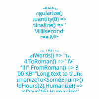

#  Humanizer

[](https://dev.azure.com/dotnet/Humanizer/_build?definitionId=14)
[](https://www.nuget.org/packages/Humanizer)
[](https://img.shields.io/nuget/vpre/Humanizer.Core)
[](https://www.nuget.org/packages/Humanizer.Core)

Humanizer meets all your .NET needs for manipulating and displaying strings, enums, dates, times, timespans, numbers and quantities.

> **📚 Full Documentation**: See the [documentation folder](docs/index.md) for comprehensive guides, examples, and API reference.


## Install

You can install Humanizer as [a NuGet package](https://www.nuget.org/packages/Humanizer):

**English only**: `Humanizer.Core`

All languages: `Humanizer`


### Supported frameworks

**Supported frameworks:** net10.0, net9.0, net8.0, net48

**netstandard2.0:** The NuGet package also targets netstandard2.0 as a special case to support specific scenarios such as Roslyn Analyzers and MSBuild tasks that require netstandard2.0.

**Unsupported versions:** While other .NET Framework versions (net4.6.1 through net4.7.2) can technically consume netstandard2.0 libraries, they are **not officially supported** by Humanizer and may not work correctly. Please use one of the explicitly supported frameworks listed above for the best experience.

Humanizer symbols are source-indexed with [SourceLink](https://github.com/dotnet/sourcelink) and included in the package, which means you can step through Humanizer's source code while debugging your own application.

> [!IMPORTANT]
> **Humanizer 3.0 restore requirements**: The `Humanizer` metapackage now requires the NuGet locale parsing fix shipped in [.NET SDK 9.0.200 and corresponding Visual Studio/MSBuild updates](https://github.com/NuGet/NuGet.Client/pull/6124#issuecomment-3391090183). Restore operations must run on .NET SDK 9.0.200 or newer, or on Visual Studio 2022/MSBuild versions that include that patch. Older SDKs/MSBuild builds will fail to restore the metapackage because they do not recognize three-letter locale identifiers. As a workaround, reference `Humanizer.Core` directly and add the desired `Humanizer.Core.<locale>` satellite packages individually when targeting older tooling.

### Specify Languages (Optional)

You choose which packages based on what NuGet package(s) you install. By default, the main `Humanizer` package installs all supported languages. If you're not sure, then just use the main `Humanizer` package.

Here are the options:

| Option | Package Name | Install Command | Included Languages |
|--------|--------------|-----------------|-------------------|
| **All languages** | `Humanizer` | `dotnet add package Humanizer` | All supported languages (pulls in `Humanizer.Core` and all language packages) |
| **English only** | `Humanizer.Core` | `dotnet add package Humanizer.Core` | English only |
| **Specific languages** | `Humanizer.Core.<locale>` | `dotnet add package Humanizer.Core.fr` (French example) | Install as many language-specific packages as needed |

For example, for French use `Humanizer.Core.fr`, for Spanish use `Humanizer.Core.es`, etc. You can include multiple languages by installing however many language packages you want.

The detailed explanation for how this works is in the comments [here](https://github.com/Humanizr/Humanizer/issues/59#issuecomment-152546079).


## Features


### Humanize String

String humanization is a core feature that transforms computerized strings into readable, human-friendly text. This is particularly valuable when you need to display programming identifiers (class names, method names, properties) to end users in a readable format.

The foundation of this feature was originally developed for the [BDDfy framework](https://github.com/TestStack/TestStack.BDDfy) to turn test method names into readable test descriptions. `Humanize` intelligently handles PascalCase, camelCase, underscored_strings, and dash-separated-strings.

```csharp
"PascalCaseInputStringIsTurnedIntoSentence".Humanize() 
    => "Pascal case input string is turned into sentence"

"Underscored_input_string_is_turned_into_sentence".Humanize() 
    => "Underscored input string is turned into sentence"

"dash-separated-string".Humanize() 
    => "Dash separated string"
```

**Acronym Handling**: Strings containing only uppercase letters are treated as acronyms and left unchanged. To humanize any string, use the `Transform` method:

```csharp
"HTML".Humanize() => "HTML"  // Acronym preserved
"HUMANIZER".Humanize() => "HUMANIZER"  // All caps preserved

// Force humanization with Transform
"HUMANIZER".Transform(To.LowerCase, To.TitleCase) => "Humanizer"
```

**Letter Casing**: Control the output casing directly:

```csharp
"CanReturnTitleCase".Humanize(LetterCasing.Title) => "Can Return Title Case"
"CanReturnLowerCase".Humanize(LetterCasing.LowerCase) => "can return lower case"
"CanHumanizeIntoUpperCase".Humanize(LetterCasing.AllCaps) => "CAN HUMANIZE INTO UPPER CASE"
"some string".Humanize(LetterCasing.Sentence) => "Some string"
```

#### Version 3.0 Behavioral Change

In version 3.0, `Humanize` and `Titleize` now preserve input strings that contain no recognized letters (e.g., special characters, unrecognized Unicode scripts) instead of returning an empty string:

```csharp
// Before v3.0: returned ""
// v3.0 and later: returns "@@"
"@@".Humanize() => "@@"

// Cyrillic and other Unicode scripts are also preserved
"Майк".Titleize() => "Майк"
```


### Dehumanize String

Reverse the humanization process by converting human-friendly strings back to PascalCase:

```csharp
"Pascal case input string is turned into sentence".Dehumanize() 
    => "PascalCaseInputStringIsTurnedIntoSentence"

"some string".Dehumanize() => "SomeString"
"Some String".Dehumanize() => "SomeString"
```


### Transform String

The `Transform` method provides a flexible, extensible way to apply string transformations. Unlike the legacy `LetterCasing` enum which limits you to built-in options, `IStringTransformer` is an interface you can implement in your codebase for domain-specific transformations.

```csharp
"Sentence casing".Transform(To.LowerCase) => "sentence casing"
"Sentence casing".Transform(To.SentenceCase) => "Sentence casing"
"Sentence casing".Transform(To.TitleCase) => "Sentence Casing"
"Sentence casing".Transform(To.UpperCase) => "SENTENCE CASING"
```


### Truncate String

Intelligently truncate strings with multiple strategies. The default uses the `…` character (one character) instead of `"..."` (three characters) to maximize visible text before truncation. You can also implement custom `ITruncator` strategies for specialized truncation logic.

```csharp
"Long text to truncate".Truncate(10) => "Long text…"
"Long text to truncate".Truncate(10, "---") => "Long te---"

// Fixed length (default)
"Long text to truncate".Truncate(10, Truncator.FixedLength) => "Long text…"

// Fixed number of words
"Long text to truncate".Truncate(2, Truncator.FixedNumberOfWords) => "Long text…"

// Truncate from the left
"Long text to truncate".Truncate(10, Truncator.FixedLength, TruncateFrom.Left) 
    => "… truncate"
```


### Humanize Enums

Enum humanization eliminates the need to manually add spaces between words in enum member names. While you could use `DescriptionAttribute` on every enum member, Humanizer automatically handles the common case of simply needing to add spaces. When `DescriptionAttribute` (or any attribute with a `Description` property) is present, it takes precedence, making it easy to provide custom text only when needed.

```csharp
public enum UserType
{
    [Description("Custom description")]
    MemberWithDescriptionAttribute,
    MemberWithoutDescriptionAttribute,
    ALLCAPITALS
}

// DescriptionAttribute value is used
UserType.MemberWithDescriptionAttribute.Humanize() => "Custom description"

// Automatic humanization when no attribute
UserType.MemberWithoutDescriptionAttribute.Humanize() 
    => "Member without description attribute"

// Apply casing transformations
UserType.MemberWithoutDescriptionAttribute.Humanize().Transform(To.TitleCase) 
    => "Member Without Description Attribute"
```

Humanizer works with any attribute containing a `Description` property and supports localized `DisplayAttribute` for multi-language scenarios. This helps you avoid littering enums with unnecessary attributes while still providing customization when needed.


### Dehumanize Enums

Convert humanized strings back to their original enum values:

```csharp
"Member without description attribute".DehumanizeTo<UserType>() 
    => UserType.MemberWithoutDescriptionAttribute

// Non-generic version for runtime types
"Member without description attribute".DehumanizeTo(typeof(UserType)) 
    => UserType.MemberWithoutDescriptionAttribute

// Handle missing matches gracefully
"Invalid".DehumanizeTo<UserType>(OnNoMatch.ReturnsNull) => null
```

The method honors `DescriptionAttribute` and is case-insensitive.


### Humanize DateTime

Get relative time descriptions for `DateTime` and `DateTimeOffset` values:

```csharp
DateTime.UtcNow.AddHours(-2).Humanize() => "2 hours ago"
DateTime.UtcNow.AddHours(-30).Humanize() => "yesterday"

DateTime.UtcNow.AddHours(2).Humanize() => "2 hours from now"
DateTime.UtcNow.AddHours(30).Humanize() => "tomorrow"

DateTimeOffset.UtcNow.AddHours(1).Humanize() => "an hour from now"
```

Supports both UTC and local times, with optional culture specification and custom comparison dates.

```csharp
public static string Humanize(this DateTime input, bool utcDate = true, DateTime? dateToCompareAgainst = null, CultureInfo culture = null)
public static string Humanize(this DateTimeOffset input, DateTimeOffset? dateToCompareAgainst = null, CultureInfo culture = null)
```

Many localizations are available for this method. Here are a few examples:

```csharp
// In ar culture
DateTime.UtcNow.AddDays(-1).Humanize() => "أمس"
DateTime.UtcNow.AddDays(-2).Humanize() => "منذ يومين"
DateTime.UtcNow.AddDays(-3).Humanize() => "منذ 3 أيام"
DateTime.UtcNow.AddDays(-11).Humanize() => "منذ 11 يوم"

// In ru-RU culture
DateTime.UtcNow.AddMinutes(-1).Humanize() => "минуту назад"
DateTime.UtcNow.AddMinutes(-2).Humanize() => "2 минуты назад"
DateTime.UtcNow.AddMinutes(-10).Humanize() => "10 минут назад"
DateTime.UtcNow.AddMinutes(-21).Humanize() => "21 минуту назад"
DateTime.UtcNow.AddMinutes(-22).Humanize() => "22 минуты назад"
DateTime.UtcNow.AddMinutes(-40).Humanize() => "40 минут назад"
```

There are two strategies for `DateTime.Humanize`: the default one as seen above and a precision based one.
To use the precision based strategy you need to configure it:

```csharp
Configurator.DateTimeHumanizeStrategy = new PrecisionDateTimeHumanizeStrategy(precision: .75);
Configurator.DateTimeOffsetHumanizeStrategy = new PrecisionDateTimeOffsetHumanizeStrategy(precision: .75); // configure when humanizing DateTimeOffset
```

The default precision is set to .75, but you can pass your desired precision too. With precision set to 0.75:

```csharp
44 seconds => 44 seconds ago/from now
45 seconds => one minute ago/from now
104 seconds => one minute ago/from now
105 seconds => two minutes ago/from now

25 days => a month ago/from now
```

**No dehumanization for dates as `Humanize` is a lossy transformation and the human friendly date is not reversible**


### Humanize TimeSpan

You can call `Humanize` on a `TimeSpan` to a get human friendly representation for it:

```csharp
TimeSpan.FromMilliseconds(1).Humanize() => "1 millisecond"
TimeSpan.FromMilliseconds(2).Humanize() => "2 milliseconds"
TimeSpan.FromDays(1).Humanize() => "1 day"
TimeSpan.FromDays(16).Humanize() => "2 weeks"
```

There is an optional `precision` parameter for `TimeSpan.Humanize` which allows you to specify the precision of the returned value.
The default value of `precision` is 1 which means only the largest time unit is returned like you saw in `TimeSpan.FromDays(16).Humanize()`.
Here are a few examples of specifying precision:

```csharp
TimeSpan.FromDays(1).Humanize(precision:2) => "1 day" // no difference when there is only one unit in the provided TimeSpan
TimeSpan.FromDays(16).Humanize(2) => "2 weeks, 2 days"

// the same TimeSpan value with different precision returns different results
TimeSpan.FromMilliseconds(1299630020).Humanize() => "2 weeks"
TimeSpan.FromMilliseconds(1299630020).Humanize(3) => "2 weeks, 1 day, 1 hour"
TimeSpan.FromMilliseconds(1299630020).Humanize(4) => "2 weeks, 1 day, 1 hour, 30 seconds"
TimeSpan.FromMilliseconds(1299630020).Humanize(5) => "2 weeks, 1 day, 1 hour, 30 seconds, 20 milliseconds"
```

By default, when using `precision` parameter empty time units are not counted towards the precision of the returned value.
If this behavior isn't desired for you, you can use the overloaded `TimeSpan.Humanize` method with `countEmptyUnits` parameter. Leading empty time units never count.
Here is an example showing the difference of counting empty units:

```csharp
TimeSpan.FromMilliseconds(3603001).Humanize(3) => "1 hour, 3 seconds, 1 millisecond"
TimeSpan.FromMilliseconds(3603001).Humanize(3, countEmptyUnits:true) => "1 hour, 3 seconds"
```

Many localizations are available for this method:

```csharp
// in de-DE culture
TimeSpan.FromDays(1).Humanize() => "Ein Tag"
TimeSpan.FromDays(2).Humanize() => "2 Tage"

// in sk-SK culture
TimeSpan.FromMilliseconds(1).Humanize() => "1 milisekunda"
TimeSpan.FromMilliseconds(2).Humanize() => "2 milisekundy"
TimeSpan.FromMilliseconds(5).Humanize() => "5 milisekúnd"
```

Culture to use can be specified explicitly. If it is not, current thread's current UI culture is used. Example:

```csharp
TimeSpan.FromDays(1).Humanize(culture: "ru-RU") => "один день"
```

In addition, a minimum unit of time may be specified to avoid rolling down to a smaller unit. For example:
  ```csharp
  TimeSpan.FromMilliseconds(122500).Humanize(minUnit: TimeUnit.Second) => "2 minutes, 2 seconds"    // instead of 2 minutes, 2 seconds, 500 milliseconds
  TimeSpan.FromHours(25).Humanize(minUnit: TimeUnit.Day) => "1 Day"   //instead of 1 Day, 1 Hour
  ```

In addition, a maximum unit of time may be specified to avoid rolling up to the next largest unit. For example:
```csharp
TimeSpan.FromDays(7).Humanize(maxUnit: TimeUnit.Day) => "7 days"    // instead of 1 week
TimeSpan.FromMilliseconds(2000).Humanize(maxUnit: TimeUnit.Millisecond) => "2000 milliseconds"    // instead of 2 seconds
```
The default maxUnit is `TimeUnit.Week` because it gives exact results. You can increase this value to `TimeUnit.Month` or `TimeUnit.Year` which will give you an approximation based on 365.2425 days a year and 30.436875 days a month. Therefore, the months are alternating between 30 and 31 days in length and every fourth year is 366 days long.
```csharp
TimeSpan.FromDays(486).Humanize(maxUnit: TimeUnit.Year, precision: 7) => "1 year, 3 months, 29 days" // One day further is 1 year, 4 month
TimeSpan.FromDays(517).Humanize(maxUnit: TimeUnit.Year, precision: 7) => "1 year, 4 months, 30 days" // This month has 30 days and one day further is 1 year, 5 months
```

When there are multiple time units, they are combined using the `", "` string:

```csharp
TimeSpan.FromMilliseconds(1299630020).Humanize(3) => "2 weeks, 1 day, 1 hour"
```

When `TimeSpan` is zero, the default behavior will return "0" plus whatever the minimum time unit is. However, if you assign `true` to `toWords` when calling `Humanize`, then the method returns "no time". For example:
```csharp
TimeSpan.Zero.Humanize(1) => "0 milliseconds"
TimeSpan.Zero.Humanize(1, toWords: true) => "no time"
TimeSpan.Zero.Humanize(1, minUnit: Humanizer.Localisation.TimeUnit.Second) => "0 seconds"
```

Using the `collectionSeparator` parameter, you can specify your own separator string:

```csharp
TimeSpan.FromMilliseconds(1299630020).Humanize(3, collectionSeparator: " - ") => "2 weeks - 1 day - 1 hour"
````

It is also possible to use the current culture's collection formatter to combine the time units. To do so, specify `null` as the `collectionSeparator` parameter:

```csharp
// in en-US culture
TimeSpan.FromMilliseconds(1299630020).Humanize(3, collectionSeparator: null) => "2 weeks, 1 day, and 1 hour"

// in de-DE culture
TimeSpan.FromMilliseconds(1299630020).Humanize(3, collectionSeparator: null) => "2 Wochen, Ein Tag und Eine Stunde"
```

If words are preferred to numbers, a `toWords: true` parameter can be set to convert the numbers in a humanized TimeSpan to words:
```csharp
TimeSpan.FromMilliseconds(1299630020).Humanize(3, toWords: true) => "two weeks, one day, one hour"
```

By calling `ToAge`, a `TimeSpan` can also be expressed as an age.
For cultures that do not define an age expression, the result will be the same as calling `Humanize` _(but with a default `maxUnit` equal to `TimeUnit.Year`)_. 

```csharp
// in en-US culture
TimeSpan.FromDays(750).ToAge() => "2 years old"

// in fr culture
TimeSpan.FromDays(750).ToAge() => "2 ans"
```


### Humanize Collections

You can call `Humanize` on any `IEnumerable` to get a nicely formatted string representing the objects in the collection. By default `ToString()` will be called on each item to get its representation but a formatting function may be passed to `Humanize` instead. Additionally, a default separator is provided ("and" in English), but a different separator may be passed into `Humanize`.

For instance:

```csharp
class SomeClass
{
    public string SomeString;
    public int SomeInt;
    public override string ToString()
    {
        return "Specific String";
    }
}

string FormatSomeClass(SomeClass sc)
{
    return string.Format("SomeObject #{0} - {1}", sc.SomeInt, sc.SomeString);
}

var collection = new List<SomeClass>
{
    new SomeClass { SomeInt = 1, SomeString = "One" },
    new SomeClass { SomeInt = 2, SomeString = "Two" },
    new SomeClass { SomeInt = 3, SomeString = "Three" }
};

collection.Humanize()                                    // "Specific String, Specific String, and Specific String"
collection.Humanize("or")                                // "Specific String, Specific String, or Specific String"
collection.Humanize(FormatSomeClass)                     // "SomeObject #1 - One, SomeObject #2 - Two, and SomeObject #3 - Three"
collection.Humanize(sc => sc.SomeInt.Ordinalize(), "or") // "1st, 2nd, or 3rd"
```

Items are trimmed and blank (NullOrWhitespace) items are skipped. This results in clean comma punctuation. (If there is a custom formatter function, this applies only to the formatter's output.)

You can provide your own collection formatter by implementing `ICollectionFormatter` and registering it with `Configurator.CollectionFormatters`.


### Inflector methods

Inflector methods handle the complexities of English pluralization and singularization rules, including irregular words (man/men, person/people) and uncountable words (fish, equipment). These methods save you from maintaining your own word lists and rules.


#### Pluralize

Intelligently pluralize words, handling irregular and uncountable forms:

```csharp
"Man".Pluralize() => "Men"
"string".Pluralize() => "strings"
"person".Pluralize() => "people"

// Uncertain plurality? Use the optional parameter
"Men".Pluralize(inputIsKnownToBeSingular: false) => "Men"
"string".Pluralize(inputIsKnownToBeSingular: false) => "strings"
```


#### Singularize

Convert plural words to singular form:

```csharp
"Men".Singularize() => "Man"
"strings".Singularize() => "string"
"people".Singularize() => "person"

// Uncertain plurality? Use the optional parameter
"Man".Singularize(inputIsKnownToBePlural: false) => "Man"
```


## Adding Words

Sometimes, you may need to add a rule from the singularization/pluralization vocabulary (the examples below are already in the `DefaultVocabulary` used by `Inflector`):

```csharp
// Adds a word to the vocabulary which cannot easily be pluralized/singularized by RegEx.
// Will match both "salesperson" and "person".
Vocabularies.Default.AddIrregular("person", "people");

// To only match "person" and not "salesperson" you would pass false for the 'matchEnding' parameter.
Vocabularies.Default.AddIrregular("person", "people", matchEnding: false);

// Adds an uncountable word to the vocabulary.  Will be ignored when plurality is changed:
Vocabularies.Default.AddUncountable("fish");

// Adds a rule to the vocabulary that does not follow trivial rules for pluralization:
Vocabularies.Default.AddPlural("bus", "buses");

// Adds a rule to the vocabulary that does not follow trivial rules for singularization
// (will match both "vertices" -> "vertex" and "indices" -> "index"):
Vocabularies.Default.AddSingular("(vert|ind)ices$", "$1ex");

```


#### ToQuantity

Combine numbers with properly pluralized/singularized words:

```csharp
"case".ToQuantity(0) => "0 cases"
"case".ToQuantity(1) => "1 case"
"case".ToQuantity(5) => "5 cases"
"man".ToQuantity(2) => "2 men"

// Display quantity as words or hide it
"case".ToQuantity(5, ShowQuantityAs.Words) => "five cases"
"case".ToQuantity(5, ShowQuantityAs.None) => "cases"

// Format with custom number formatting
"dollar".ToQuantity(2, "C0", new CultureInfo("en-US")) => "$2 dollars"
"cases".ToQuantity(12000, "N0") => "12,000 cases"
```


#### Ordinalize

Convert numbers to ordinal strings (1st, 2nd, 3rd, etc.):

```csharp
1.Ordinalize() => "1st"
5.Ordinalize() => "5th"
21.Ordinalize() => "21st"
"21".Ordinalize() => "21st"

// Supports grammatical gender (culture-specific)
1.Ordinalize(GrammaticalGender.Feminine) => "1ª"  // Brazilian Portuguese
1.Ordinalize(GrammaticalGender.Masculine) => "1º"  // Brazilian Portuguese
```


#### Titleize, Pascalize, Camelize

Convert strings to various coding conventions:

```csharp
// Titleize: Title Case with spaces
"some_title".Titleize() => "Some Title"

// Pascalize: UpperCamelCase without spaces
"some_title for something".Pascalize() => "SomeTitleForSomething"

// Camelize: lowerCamelCase without spaces
"some_title for something".Camelize() => "someTitleForSomething"
```


#### Underscore, Dasherize, Kebaberize

Transform to common naming conventions:

```csharp
// Underscore: snake_case
"SomeTitle".Underscore() => "some_title"

// Dasherize/Hyphenate: Replace underscores with dashes
"some_title".Dasherize() => "some-title"
"some_title".Hyphenate() => "some-title"

// Kebaberize: kebab-case (lowercase with hyphens)
"SomeText".Kebaberize() => "some-text"
"some property name".Kebaberize() => "some-property-name"
```


### Fluent Date

Fluent date methods make time-based code dramatically more readable. Instead of verbose `DateTime.Now.AddDays(2).AddHours(3)` calls, you can write `DateTime.Now + 2.Days() + 3.Hours()`. This improves code clarity and reduces errors.

**TimeSpan methods:**

```csharp
2.Milliseconds() => TimeSpan.FromMilliseconds(2)
5.Seconds() => TimeSpan.FromSeconds(5)
3.Minutes() => TimeSpan.FromMinutes(3)
4.Hours() => TimeSpan.FromHours(4)
7.Days() => TimeSpan.FromDays(7)
2.Weeks() => TimeSpan.FromDays(14)
```

**Use fluent syntax instead of verbose `Add` methods:**

```csharp
// Instead of this:
DateTime.Now.AddDays(2).AddHours(3).AddMinutes(-5)

// Write this:
DateTime.Now + 2.Days() + 3.Hours() - 5.Minutes()
```

**DateTime construction:**

```csharp
In.TheYear(2010) => new DateTime(2010, 1, 1)
In.January => January 1st of current year
In.FebruaryOf(2009) => February 1st, 2009

On.January.The4th => January 4th of current year
On.February.The(12) => February 12th of current year
```

**DateTime manipulation:**

```csharp
var date = new DateTime(2011, 2, 10, 5, 25, 45, 125);

date.In(2008) => Changes year to 2008
date.At(2, 20, 15) => Changes time to 2:20:15.125
date.AtNoon() => Changes time to 12:00:00
date.AtMidnight() => Changes time to 00:00:00
```


### Number to numbers

Create large numbers with readable fluent syntax:

```csharp
3.Thousands() => 3000
5.Millions() => 5000000
1.25.Billions() => 1250000000

// Chain for complex values
3.Hundreds().Thousands() => 300000
```


### Number to words

Convert numbers to their word representation:

```csharp
1.ToWords() => "one"
10.ToWords() => "ten"
122.ToWords() => "one hundred and twenty-two"
3501.ToWords() => "three thousand five hundred and one"

// Grammatical gender support (culture-specific)
1.ToWords(GrammaticalGender.Masculine, new CultureInfo("ru")) => "один"
1.ToWords(GrammaticalGender.Feminine, new CultureInfo("ru")) => "одна"

// Control "and" usage
3501.ToWords(addAnd: false) => "three thousand five hundred one"
```


### Number to ordinal words

Convert numbers to ordinal word form (first, second, third, etc.):

```csharp
0.ToOrdinalWords() => "zeroth"
1.ToOrdinalWords() => "first"
2.ToOrdinalWords() => "second"
10.ToOrdinalWords() => "tenth"
21.ToOrdinalWords() => "twenty first"
121.ToOrdinalWords() => "hundred and twenty first"

// Grammatical gender support (culture-specific)
1.ToOrdinalWords(GrammaticalGender.Masculine, new CultureInfo("pt-BR")) => "primeiro"
1.ToOrdinalWords(GrammaticalGender.Feminine, new CultureInfo("pt-BR")) => "primeira"
```

### Words to Number Conversion

Convert English words to numbers (currently English-only):

```csharp
"twenty".ToNumber(new CultureInfo("en")) => 20
"one hundred and five".ToNumber(new CultureInfo("en")) => 105
"three thousand two hundred".ToNumber(new CultureInfo("en")) => 3200

// Try pattern for safe conversion
if ("forty-two".TryToNumber(out var number, new CultureInfo("en")))
    Console.WriteLine(number); // Outputs: 42

// Get unrecognized words on failure
if (!"tenn".TryToNumber(out var invalid, new CultureInfo("en"), out var badWord))
    Console.WriteLine($"Unrecognized word: {badWord}"); // Outputs: Unrecognized word: tenn
```

> **Note:** Only English (`en`) is currently supported. Other languages throw `NotSupportedException`.

### DateTime to ordinal words

Convert dates to ordinal word format:

```csharp
// English UK
new DateTime(2015, 1, 1).ToOrdinalWords() => "1st January 2015"
new DateTime(2015, 3, 22).ToOrdinalWords() => "22nd March 2015"

// English US
new DateTime(2015, 1, 1).ToOrdinalWords() => "January 1st, 2015"
new DateTime(2015, 2, 12).ToOrdinalWords() => "February 12th, 2015"

// Grammatical case support (culture-specific)
new DateTime(2015, 1, 1).ToOrdinalWords(GrammaticalCase.Genitive)
```


### TimeOnly to Clock Notation

Convert `TimeOnly` to readable clock notation (.NET 6+):

```csharp
// English US
new TimeOnly(3, 0).ToClockNotation() => "three o'clock"
new TimeOnly(12, 0).ToClockNotation() => "noon"
new TimeOnly(14, 30).ToClockNotation() => "half past two"

// Brazilian Portuguese
new TimeOnly(3, 0).ToClockNotation() => "três em ponto"
new TimeOnly(14, 30).ToClockNotation() => "duas e meia"

// Round to nearest 5 minutes
new TimeOnly(15, 7).ToClockNotation(ClockNotationRounding.NearestFiveMinutes) 
    => "five past three"
```


### Roman numerals

Convert between integers and Roman numerals:

```csharp
// To Roman (supports 1-3999)
1.ToRoman() => "I"
4.ToRoman() => "IV"
10.ToRoman() => "X"
1990.ToRoman() => "MCMXC"

// From Roman
"XIV".FromRoman() => 14
"MCMXC".FromRoman() => 1990
```


### Metric numerals

Convert between numbers and metric notation:

```csharp
// To Metric
1d.ToMetric() => "1"
1230d.ToMetric() => "1.23k"
0.1d.ToMetric() => "100m"
456789.ToMetric(decimals: 2) => "456.79k"

// From Metric
"1.23k".FromMetric() => 1230
"100m".FromMetric() => 0.1
```


### ByteSize

Humanizer includes a port of the brilliant [ByteSize](https://github.com/omar/ByteSize) library.
Quite a few changes and additions are made on `ByteSize` to make the interaction with `ByteSize` easier and more consistent with the Humanizer API.
Here are a few examples of how you can convert from numbers to byte sizes and between size magnitudes:

```c#
var fileSize = (10).Kilobytes();

fileSize.Bits      => 81920
fileSize.Bytes     => 10240
fileSize.Kilobytes => 10
fileSize.Megabytes => 0.009765625
fileSize.Gigabytes => 9.53674316e-6
fileSize.Terabytes => 9.31322575e-9
```

There are a few extension methods that allow you to turn a number into a ByteSize instance:

```csharp
3.Bits();
5.Bytes();
(10.5).Kilobytes();
(2.5).Megabytes();
(10.2).Gigabytes();
(4.7).Terabytes();
```

You can also add/subtract the values using +/- operators and Add/Subtract methods:

```csharp
var total = (10).Gigabytes() + (512).Megabytes() - (2.5).Gigabytes();
total.Subtract((2500).Kilobytes()).Add((25).Megabytes());
```

A `ByteSize` object contains two properties that represent the largest metric prefix symbol and value:

```csharp
var maxFileSize = (10).Kilobytes();

maxFileSize.LargestWholeNumberSymbol;  // "KB"
maxFileSize.LargestWholeNumberValue;   // 10
```

If you want a string representation you can call `ToString` or `Humanize` interchangeably on the `ByteSize` instance:

```csharp
7.Bits().ToString();           // 7 b
8.Bits().ToString();           // 1 B
(.5).Kilobytes().Humanize();   // 512 B
(1000).Kilobytes().ToString(); // 1000 KB
(1024).Kilobytes().Humanize(); // 1 MB
(.5).Gigabytes().Humanize();   // 512 MB
(1024).Gigabytes().ToString(); // 1 TB
```

You can also optionally provide a format for the expected string representation.
The formatter can contain the symbol of the value to display: `b`, `B`, `KB`, `MB`, `GB`, `TB`.
The formatter uses the built in [`double.ToString` method](https://docs.microsoft.com/dotnet/api/system.double.tostring) with `#.##` as the default format which rounds the number to two decimal places:

```csharp
var b = (10.505).Kilobytes();

// Default number format is #.##
b.ToString("KB");         // 10.52 KB
b.Humanize("MB");         // .01 MB
b.Humanize("b");          // 86057 b

// Default symbol is the largest metric prefix value >= 1
b.ToString("#.#");        // 10.5 KB

// All valid values of double.ToString(string format) are acceptable
b.ToString("0.0000");     // 10.5050 KB
b.Humanize("000.00");     // 010.51 KB

// You can include number format and symbols
b.ToString("#.#### MB");  // .0103 MB
b.Humanize("0.00 GB");    // 0 GB
b.Humanize("#.## B");     // 10757.12 B
```

If you want a string representation with full words you can call `ToFullWords` on the `ByteSize` instance:

```csharp
7.Bits().ToFullWords();           // 7 bits
8.Bits().ToFullWords();           // 1 byte
(.5).Kilobytes().ToFullWords();   // 512 bytes
(1000).Kilobytes().ToFullWords(); // 1000 kilobytes
(1024).Kilobytes().ToFullWords(); // 1 megabyte
(.5).Gigabytes().ToFullWords();   // 512 megabytes
(1024).Gigabytes().ToFullWords(); // 1 terabyte
```

There isn't a `Dehumanize` method to turn a string representation back into a `ByteSize` instance; but you can use `Parse` and `TryParse` on `ByteSize` to do that.
Like other `TryParse` methods, `ByteSize.TryParse` returns `boolean` value indicating whether the parsing was successful.
If the value is parsed it is output to the `out` parameter supplied:

```csharp
ByteSize output;
ByteSize.TryParse("1.5mb", out output);

// Invalid
ByteSize.Parse("1.5 b");   // Can't have partial bits

// Valid
ByteSize.Parse("5b");
ByteSize.Parse("1.55B");
ByteSize.Parse("1.55KB");
ByteSize.Parse("1.55 kB "); // Spaces are trimmed
ByteSize.Parse("1.55 kb");
ByteSize.Parse("1.55 MB");
ByteSize.Parse("1.55 mB");
ByteSize.Parse("1.55 mb");
ByteSize.Parse("1.55 GB");
ByteSize.Parse("1.55 gB");
ByteSize.Parse("1.55 gb");
ByteSize.Parse("1.55 TB");
ByteSize.Parse("1.55 tB");
ByteSize.Parse("1.55 tb");
```

Finally, if you need to calculate the rate at which a quantity of bytes has been transferred, you can use the `Per` method of `ByteSize`. The `Per` method accepts one argument - the measurement interval for the bytes; this is the amount of time it took to transfer the bytes.

The `Per` method returns a `ByteRate` class which has a `Humanize` method. By default, rates are given in seconds (eg, MB/s). However, if desired, a TimeUnit may be passed to `Humanize` for an alternate interval. Valid intervals are `TimeUnit.Second`, `TimeUnit.Minute`, and `TimeUnit.Hour`. Examples of each interval and example byte rate usage is below.

```csharp
var size = ByteSize.FromMegabytes(10);
var measurementInterval = TimeSpan.FromSeconds(1);

var text = size.Per(measurementInterval).Humanize();
// 10 MB/s

text = size.Per(measurementInterval).Humanize(TimeUnit.Minute);
// 600 MB/min

text = size.Per(measurementInterval).Humanize(TimeUnit.Hour);
// 35.15625 GB/hour
```

You can specify a format for the bytes part of the humanized output:

```csharp
19854651984.Bytes().Per(1.Seconds()).Humanize("#.##");
// 18.49 GB/s
```


### Heading to words

Humanizer includes methods to change a numeric heading to words. The heading can be a `double` whereas the result will be a string. You can choose whether to return a full representation of the heading (e.g. north, east, south or west), a short representation (e.g. N, E, S, W) or a Unicode arrow character (e.g. ↑, →, ↓, ←).

```csharp
360.ToHeading();
// N
720.ToHeading();
// N
```

To retrieve a full version of the heading, use the following call:

```csharp
180.ToHeading(HeadingStyle.Full);
// south
360.ToHeading(HeadingStyle.Full);
// north
```

Please note that a textual representation has a maximum deviation of 11.25°.

The methods above all have an overload with which you can provide a `CultureInfo` object in order to determine the localized result to return.

To retrieve an arrow representing the heading use the following method:

```csharp
90.ToHeadingArrow();
// →
225.ToHeadingArrow();
// ↙
```

The arrow representation of the heading has a maximum deviation of 22.5°.

In order to retrieve a heading based on the short text representation (e.g. N, E, S, W), the following method can be used:

```csharp
"S".FromShortHeading();
// 180
"SW".FromShortHeading();
// 225
```


### Tupleize

Humanizer can change whole numbers into their 'tuple'  using `Tupleize`. For example:

```csharp
1.Tupleize();
// single
3.Tupleize();
// triple
100.Tupleize();
// centuple
```

The numbers 1-10, 100 and 1000 will be converted into a 'named' tuple (i.e. "single", "double" etc.). Any other number "n" will be converted to "n-tuple".


### Time unit to symbol

Humanizer can translate time units to their symbols:

```csharp
TimeUnit.Day.ToSymbol();
// d
TimeUnit.Week.ToSymbol();
// week
TimeUnit.Year.ToSymbol();
// y
```


## Mix this into your framework to simplify your life

This is just a baseline, and you can use this to simplify your day-to-day job. For example, in Asp.Net MVC we keep chucking `Display` attribute on ViewModel properties so `HtmlHelper` can generate correct labels for us; but, just like enums, in the vast majority of cases we just need a space between the words in property name - so why not use `"string".Humanize` for that?!

You may find an ASP.NET MVC sample [in the code](https://github.com/Humanizr/Humanizer/tree/v2.7.9/samples/Humanizer.MvcSample) that does that (although the project is excluded from the solution file to make the NuGet package available for .NET 3.5 too).

This is achieved using a custom `DataAnnotationsModelMetadataProvider` I called [HumanizerMetadataProvider](https://github.com/Humanizr/Humanizer/blob/v2.7.9/samples/Humanizer.MvcSample/HumanizerMetadataProvider.cs). It is small enough to repeat here; so here we go:

```csharp
using System;
using System.Collections.Generic;
using System.ComponentModel;
using System.ComponentModel.DataAnnotations;
using System.Linq;
using System.Web.Mvc;
using Humanizer;

public class HumanizerMetadataProvider : DataAnnotationsModelMetadataProvider
{
    protected override ModelMetadata CreateMetadata(
        IEnumerable<Attribute> attributes,
        Type containerType,
        Func<object> modelAccessor,
        Type modelType,
        string propertyName)
    {
        var propertyAttributes = attributes.ToList();
        var modelMetadata = base.CreateMetadata(propertyAttributes, containerType, modelAccessor, modelType, propertyName);

        if (IsTransformRequired(modelMetadata, propertyAttributes))
            modelMetadata.DisplayName = modelMetadata.PropertyName.Humanize();

        return modelMetadata;
    }

    private static bool IsTransformRequired(ModelMetadata modelMetadata, IList<Attribute> propertyAttributes)
    {
        if (string.IsNullOrEmpty(modelMetadata.PropertyName))
            return false;

        if (propertyAttributes.OfType<DisplayNameAttribute>().Any())
            return false;

        if (propertyAttributes.OfType<DisplayAttribute>().Any())
            return false;

        return true;
    }
}
```

This class calls the base class to extract the metadata and then, if required, humanizes the property name.
It is checking if the property already has a `DisplayName` or `Display` attribute on it in which case the metadata provider will just honor the attribute and leave the property alone.
For other properties it will Humanize the property name. That is all.

Now you need to register this metadata provider with Asp.Net MVC.
Make sure you use `System.Web.Mvc.ModelMetadataProviders`, and not `System.Web.ModelBinding.ModelMetadataProviders`:

```csharp
ModelMetadataProviders.Current = new HumanizerMetadataProvider();
```

... and now you can replace:

```csharp
public class RegisterModel
{
    [Display(Name = "User name")]
    public string UserName { get; set; }

    [Display(Name = "Email address")]
    public string EmailAddress { get; set; }

    [Display(Name = "Confirm password")]
    public string ConfirmPassword { get; set; }
}
```

with:

```csharp
public class RegisterModel
{
    public string UserName { get; set; }
    public string EmailAddress { get; set; }
    public string ConfirmPassword { get; set; }
}
```

... and the "metadata humanizer" will take care of the rest.

No need to mention that if you want title casing for your labels you can chain the method with `Transform`:

```csharp
modelMetadata.DisplayName = modelMetadata.PropertyName.Humanize().Transform(To.TitleCase);
```


## Use in ASP.NET 4.x MVC Views

Humanizer is a Portable Class Library. There is currently [an issue](https://stackoverflow.com/questions/16675171/what-does-the-web-config-compilation-assemblies-element-do) if you try to use PCL's in an MVC view since the MVC views do not share the same build system as the regular project. You must specify all references in the `web.config` file, including ones the project system normally automatically adds.

If you encounter errors saying that you must add a reference to either `System.Runtime` or `System.Globalization`, this applies to you. The solution is to add the contract references to your `web.config` as listed [here](https://stackoverflow.com/a/19942274/738188). Note that this applies to any PCL you use in an MVC view, not just Humanizer.


## Continuous Integration from Azure DevOps

The Humanizer project is built & tested continuously by Azure DevOps (more details [here](https://dev.azure.com/dotnet/Humanizer/_build?definitionId=14)). That applies to pull requests too. Shortly after you submit a PR you can check the build and test status notification on your PR.

The current build status on the CI server is [](https://dev.azure.com/dotnet/Humanizer/_build?definitionId=14)

## Related projects

Below is a list of related open-source projects:


### Humanizer ReSharper Annotations

If using ReSharper, annotations for Humanizer are available in the [Humanizer.Annotations package](https://resharper-plugins.jetbrains.com/packages/Humanizer.Annotations/), which you can obtain via the ReSharper Extension Manager.
These annotations do not yet cover the entire library, but [pull requests are always welcome!](https://github.com/enduracode/humanizer-annotations).


### PowerShell Humanizer

[PowerShell Humanizer](https://github.com/dfinke/PowerShellHumanizer) is a PowerShell module that wraps Humanizer.


### Humanizer JVM

[Humanizer.jvm](https://github.com/MehdiK/Humanizer.jvm) is an adaptation of the Humanizer framework for .Net which is made for the jvm and is written in Kotlin.
Humanizer.jvm meets all your jvm needs for manipulating and displaying strings, enums, dates, times, timespans, numbers and quantities.


### Humanizer.node

[Humanizer.node](https://github.com/fakoua/humanizer.node) is a TypeScript port of the Humanizer framework.


## Contributing

We welcome contributions! If you'd like to contribute to Humanizer:

- **Found a bug?** Please [open an issue](https://github.com/Humanizr/Humanizer/issues/new)
- **Have a feature idea?** Create an issue to discuss it
- **Want to submit code?** Read our [contribution guidelines](.github/CONTRIBUTING.md) and submit a pull request

Please read our [Code of Conduct](.github/CODE_OF_CONDUCT.md) before contributing.


## License

Humanizer is licensed under the [MIT License](license.txt).

Copyright (c) .NET Foundation and Contributors


## Reporting Issues

If you encounter any bugs or have feature requests, please:

1. Check if the issue already exists in our [issue tracker](https://github.com/Humanizr/Humanizer/issues)
2. If not, [create a new issue](https://github.com/Humanizr/Humanizer/issues/new) with:
   - A clear description of the problem or feature request
   - Steps to reproduce (for bugs)
   - Expected vs actual behavior (for bugs)
   - Your environment details (OS, .NET version, Humanizer version)


## Icon

The icon was created by [Tyrone Rieschiek](https://twitter.com/Inkventive)
